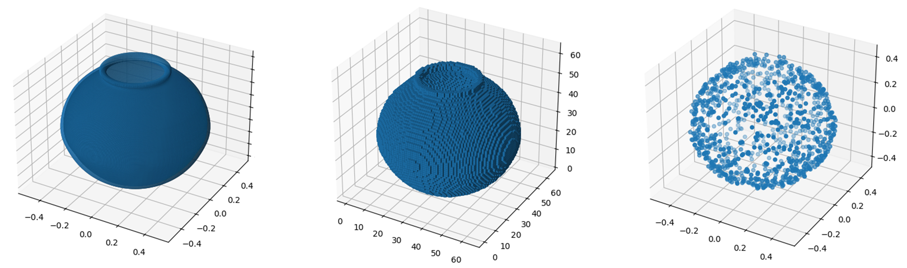
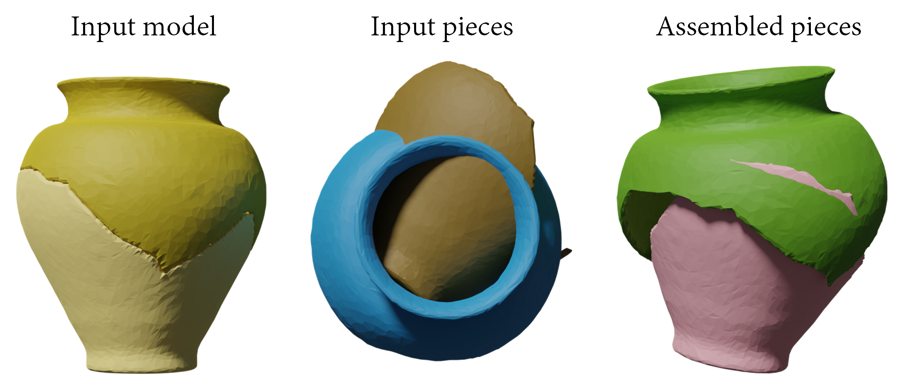

# Generating implicit object fragment datasets for machine learning

    

## Data download

The fragment data is available at <a href="https://s5-ceatic.ujaen.es/fragment-dataset-uja/">our research institute's page</a>. Please, note that there are two datasets; one is split into eight files since it is approximately 450GB, whereas the other (`vessels_200_obj_ply_no_zipped.zip`) is lighter (27 GB). The latter is intended for testing the dataset since it only contains decimated fragments of 200 models, with no individual zipping.

Otherwise, please go to `decompress` folder to learn how to decompress binary files (triangle meshes, point clouds and voxelizations). Point clouds are decompressed in C++ using the Point Cloud Library, whereas the others are decompressed using Python.

    

## Training

To compare the performance of popular fracture assembly networks over our fragments, we used the baseline project of <a href="https://github.com/Wuziyi616/multi_part_assembly/">Sellán et al. (2023)</a>. It provides DGL-Net, RGL-Net as well as a simple LSTM architecture. We compared our dataset against their artifact dataset, which is the most similar to ours (obtained from real-world scanned items), and the lighter version of our dataset (200 artefacts x 1000 fragments). Although the mentioned networks were proved to be far from exceptional results, similar values were obtained when evaluating both datasets in terms of Chamfer distance, Mean Absolute Error (MAE), Mean Root Squared Error (RMSE) and part accuracy (PA). 

The following image depicts a sample of assembled pieces after being processed by the network. In the middle, the initial pieces centred at (0, 0, 0) and randomly rotated; on the left side, the expected assembly.

    

